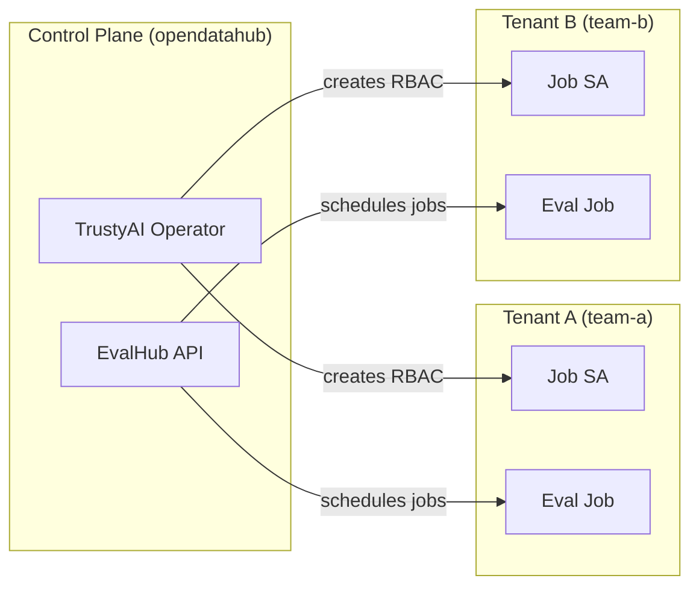
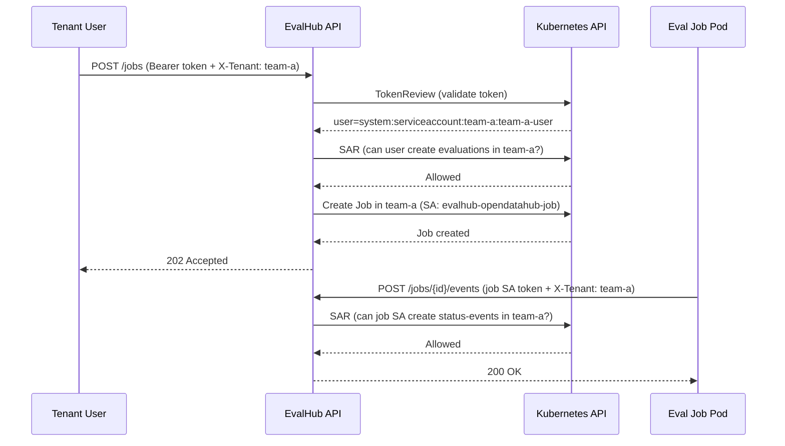

# Multi-Tenancy

Guide for deploying EvalHub with namespace-based multi-tenancy on OpenShift.

## Overview

EvalHub uses Kubernetes namespaces as tenant boundaries. Each tenant operates in its own namespace, and access is enforced through Kubernetes RBAC via SubjectAccessReview (SAR) checks.

The core principle is: **namespace = tenant = MLFlow workspace**.



### How tenant isolation works

1. **Authentication** -- Bearer tokens (SA tokens) are validated via the Kubernetes TokenReview API
2. **Authorisation** -- Every API request includes an `X-Tenant` header. EvalHub runs a SAR check: _"can this user perform this action in the tenant namespace?"_
3. **Data isolation** -- All database queries are filtered by `tenant_id`
4. **Job isolation** -- Evaluation jobs run in the tenant namespace with a scoped ServiceAccount

## Prerequisites

Before setting up multi-tenancy, ensure you have:

- A working EvalHub deployment (see [OpenShift Setup](openshift-setup.md))
- Cluster-admin access (for creating namespaces and ClusterRoleBindings)
- The TrustyAI Operator installed and reconciling

## Step 1: Deploy EvalHub

Create an EvalHub instance in the control-plane namespace. For multi-tenancy, a persistent database is recommended:

```yaml
apiVersion: trustyai.opendatahub.io/v1alpha1
kind: EvalHub
metadata:
  name: evalhub
  namespace: opendatahub
spec:
  replicas: 1
  database:
    secret: evalhub-db-credentials
```

The operator automatically creates:

| Resource | Namespace | Purpose |
|----------|-----------|---------|
| `evalhub-service` SA | `opendatahub` | API server identity |
| `evalhub-opendatahub-job` SA | `opendatahub` | Jobs in the control-plane namespace |
| ClusterRoleBinding for auth-reviewer | cluster-wide | Allows SAR and TokenReview checks |
| RoleBindings for jobs-writer, job-config | `opendatahub` | Allows creating Jobs and ConfigMaps |

## Step 2: Create tenant namespaces

Create a namespace for each tenant:

```bash
oc create namespace team-a
oc create namespace team-b
```

## Step 3: Create job ServiceAccounts in tenant namespaces

The operator creates a job SA and its RBAC bindings in the **EvalHub instance namespace** automatically during reconciliation. However, it does not yet create them in tenant namespaces — this must be done manually for each tenant.

!!! info "What the operator creates automatically"
    In the **instance namespace** (e.g. `opendatahub`), the controller creates: the `evalhub-service` SA, the `evalhub-opendatahub-job` SA, all RoleBindings (jobs-writer, job-config, job-access, MLFlow), and the auth-reviewer ClusterRoleBinding. You do **not** need to create these manually.

For each **tenant namespace**, create the job ServiceAccount and its RoleBindings:

```bash
EVALHUB_NAME=evalhub
EVALHUB_NS=opendatahub
TENANT_NS=team-a

# Job SA name follows the pattern: {evalhub-name}-{evalhub-namespace}-job
JOB_SA_NAME="${EVALHUB_NAME}-${EVALHUB_NS}-job"
```

**Create the job ServiceAccount:**

```bash
oc apply -f - <<EOF
apiVersion: v1
kind: ServiceAccount
metadata:
  name: ${JOB_SA_NAME}
  namespace: ${TENANT_NS}
  labels:
    app.kubernetes.io/part-of: eval-hub
    eval-hub.trustyai.opendatahub.io: ${EVALHUB_NAME}.${EVALHUB_NS}
EOF
```

**Create the job access Role (status-events only):**

```bash
oc apply -f - <<EOF
apiVersion: rbac.authorization.k8s.io/v1
kind: Role
metadata:
  name: ${EVALHUB_NAME}-${EVALHUB_NS}-job-access-role
  namespace: ${TENANT_NS}
rules:
  - apiGroups: [trustyai.opendatahub.io]
    resources: [status-events]
    verbs: [create]
EOF
```

**Bind the job SA to the access Role:**

```bash
oc apply -f - <<EOF
apiVersion: rbac.authorization.k8s.io/v1
kind: RoleBinding
metadata:
  name: ${EVALHUB_NAME}-${EVALHUB_NS}-job-access-rb
  namespace: ${TENANT_NS}
roleRef:
  apiGroup: rbac.authorization.k8s.io
  kind: Role
  name: ${EVALHUB_NAME}-${EVALHUB_NS}-job-access-role
subjects:
  - kind: ServiceAccount
    name: ${JOB_SA_NAME}
    namespace: ${TENANT_NS}
EOF
```

**Bind the job SA to the jobs-writer ClusterRole** (so the EvalHub API can create jobs in the tenant namespace):

```bash
oc apply -f - <<EOF
apiVersion: rbac.authorization.k8s.io/v1
kind: RoleBinding
metadata:
  name: ${EVALHUB_NAME}-job-writer-rb
  namespace: ${TENANT_NS}
roleRef:
  apiGroup: rbac.authorization.k8s.io
  kind: ClusterRole
  name: evalhub-jobs-writer
subjects:
  - kind: ServiceAccount
    name: evalhub-service
    namespace: ${EVALHUB_NS}
EOF
```

**Bind the job SA to the job-config ClusterRole** (for ConfigMap management):

```bash
oc apply -f - <<EOF
apiVersion: rbac.authorization.k8s.io/v1
kind: RoleBinding
metadata:
  name: ${EVALHUB_NAME}-job-config-rb
  namespace: ${TENANT_NS}
roleRef:
  apiGroup: rbac.authorization.k8s.io
  kind: ClusterRole
  name: evalhub-job-config
subjects:
  - kind: ServiceAccount
    name: evalhub-service
    namespace: ${EVALHUB_NS}
EOF
```

**If using MLFlow, bind the job SA to the MLFlow jobs ClusterRole:**

```bash
oc apply -f - <<EOF
apiVersion: rbac.authorization.k8s.io/v1
kind: RoleBinding
metadata:
  name: ${EVALHUB_NAME}-${EVALHUB_NS}-mlflow-job-rb
  namespace: ${TENANT_NS}
roleRef:
  apiGroup: rbac.authorization.k8s.io
  kind: ClusterRole
  name: evalhub-mlflow-jobs-access
subjects:
  - kind: ServiceAccount
    name: ${JOB_SA_NAME}
    namespace: ${TENANT_NS}
EOF
```

Repeat for each tenant namespace (`team-b`, etc.).

## Step 4: Create tenant users

Each tenant needs a ServiceAccount (or user) with permissions scoped to their namespace. This is the identity that API consumers use to authenticate.

**Create a tenant ServiceAccount:**

```bash
oc apply -f - <<EOF
apiVersion: v1
kind: ServiceAccount
metadata:
  name: team-a-user
  namespace: team-a
EOF
```

**Grant evaluation permissions in the tenant namespace:**

```bash
oc apply -f - <<EOF
apiVersion: rbac.authorization.k8s.io/v1
kind: Role
metadata:
  name: evalhub-evaluator
  namespace: team-a
rules:
  - apiGroups: [trustyai.opendatahub.io]
    resources: [evaluations, collections, providers]
    verbs: [get, list, create, update, delete]
  - apiGroups: [mlflow.kubeflow.org]
    resources: [experiments]
    verbs: [create, get]
---
apiVersion: rbac.authorization.k8s.io/v1
kind: RoleBinding
metadata:
  name: evalhub-evaluator-binding
  namespace: team-a
roleRef:
  apiGroup: rbac.authorization.k8s.io
  kind: Role
  name: evalhub-evaluator
subjects:
  - kind: ServiceAccount
    name: team-a-user
    namespace: team-a
EOF
```

!!! info "Virtual resources"
    The resources in the Role (`evaluations`, `collections`, `providers`, `status-events`) are virtual -- they don't correspond to actual Kubernetes API resources. EvalHub uses them as SAR targets to enforce fine-grained access control via the Kubernetes authorisation API.

## Step 5: Access the API with tenant scoping

All evaluation API requests must include the `X-Tenant` header set to the target namespace.

**Get a token for the tenant user:**

```bash
TOKEN=$(oc create token team-a-user -n team-a --duration=1h)
```

**Get the EvalHub route:**

```bash
EVALHUB_URL=$(oc get route evalhub -n opendatahub -o jsonpath='{.spec.host}')
```

**List providers (scoped to team-a):**

```bash
curl -sS -k \
  -H "Authorization: Bearer $TOKEN" \
  -H "X-Tenant: team-a" \
  "https://$EVALHUB_URL/api/v1/evaluations/providers" | jq .
```

**Submit an evaluation job:**

```bash
curl -sS -k -X POST \
  -H "Authorization: Bearer $TOKEN" \
  -H "X-Tenant: team-a" \
  -H "Content-Type: application/json" \
  -d '{
    "model": {
      "url": "http://vllm-server.team-a.svc.cluster.local:8000/v1",
      "name": "meta-llama/Llama-3.2-1B-Instruct"
    },
    "benchmarks": [
      {
        "id": "mmlu",
        "provider_id": "lm_evaluation_harness"
      }
    ]
  }' \
  "https://$EVALHUB_URL/api/v1/evaluations/jobs" | jq .
```

The job pod will be created in the `team-a` namespace using the `evalhub-opendatahub-job` ServiceAccount.

**Cross-tenant access is denied:**

```bash
# This will return 403 Forbidden
curl -sS -k -X GET \
  -H "Authorization: Bearer $TOKEN" \
  -H "X-Tenant: team-b" \
  "https://$EVALHUB_URL/api/v1/evaluations/jobs"
```

The SAR check fails because `team-a-user` has no permissions in the `team-b` namespace.

## Authorisation model

EvalHub uses an embedded SAR authoriser. The auth config (`config/auth.yaml`) maps API endpoints to Kubernetes resource attributes:

| Endpoint | Resource | Verb | Namespace source |
|----------|----------|------|------------------|
| `POST /api/v1/evaluations/jobs` | `evaluations` | `create` | `X-Tenant` header |
| `GET /api/v1/evaluations/jobs` | `evaluations` | `get` | `X-Tenant` header |
| `POST /api/v1/evaluations/jobs/*/events` | `status-events` | `create` | `X-Tenant` header |
| `* /api/v1/evaluations/collections` | `collections` | _(from HTTP method)_ | `X-Tenant` header |
| `* /api/v1/evaluations/providers` | `providers` | _(from HTTP method)_ | `X-Tenant` header |

For `POST /api/v1/evaluations/jobs`, two additional SAR checks are performed for MLFlow access (`mlflow.kubeflow.org/experiments` with `create` and `get` verbs).

### Request flow



## RBAC reference

### ClusterRoles (installed by operator)

| ClusterRole | Purpose | Key permissions |
|-------------|---------|-----------------|
| `evalhub-auth-reviewer-role` | Token and SAR validation | `tokenreviews`, `subjectaccessreviews` |
| `evalhub-jobs-writer` | Create evaluation jobs | `batch/jobs` (create, delete) |
| `evalhub-job-config` | Manage job config | `configmaps` (create, get, update, delete) |
| `evalhub-providers-access` | Providers endpoint SAR | `providers` (get) |
| `evalhub-collections-access` | Collections endpoint SAR | `collections` (get) |
| `evalhub-mlflow-access` | API server MLFlow access | `experiments` (create, get, list, update, delete) |
| `evalhub-mlflow-jobs-access` | Job pod MLFlow access | `experiments` (create, get, list) |

### Per-tenant resources

For each tenant namespace, the following resources are required:

| Resource | Name pattern | Purpose |
|----------|-------------|---------|
| ServiceAccount | `{name}-{evalhub-ns}-job` | Identity for job pods |
| Role | `{name}-{evalhub-ns}-job-access-role` | Allows `status-events/create` |
| RoleBinding | `{name}-{evalhub-ns}-job-access-rb` | Binds job SA to access Role |
| RoleBinding | `{name}-job-writer-rb` | Binds API SA to jobs-writer ClusterRole |
| RoleBinding | `{name}-job-config-rb` | Binds API SA to job-config ClusterRole |
| RoleBinding | `{name}-{evalhub-ns}-mlflow-job-rb` | Binds job SA to MLFlow ClusterRole |

### ServiceAccount naming

The job SA name includes the EvalHub instance namespace to prevent collisions when multiple EvalHub instances (potentially with the same CR name in different namespaces) create jobs in the same tenant namespace:

```
{evalhub-cr-name}-{evalhub-namespace}-job
```

For example, an EvalHub CR named `evalhub` in namespace `opendatahub` produces:

```
evalhub-opendatahub-job
```

## Verifying the setup

### Check RBAC is in place

```bash
# Verify job SA exists in tenant namespace
oc get sa evalhub-opendatahub-job -n team-a

# Verify RoleBindings
oc get rolebindings -n team-a | grep evalhub

# Test permissions for tenant user
oc auth can-i create evaluations.trustyai.opendatahub.io \
  -n team-a \
  --as=system:serviceaccount:team-a:team-a-user

# Test cross-tenant denial
oc auth can-i create evaluations.trustyai.opendatahub.io \
  -n team-b \
  --as=system:serviceaccount:team-a:team-a-user
```

### Check job execution

```bash
# List jobs in tenant namespace
oc get jobs -n team-a -l app.kubernetes.io/part-of=eval-hub

# Check job pod SA
oc get pod -n team-a -l app.kubernetes.io/part-of=eval-hub \
  -o jsonpath='{.items[0].spec.serviceAccountName}'
# Expected: evalhub-opendatahub-job
```

## Troubleshooting

### 403 Forbidden on API calls

The SAR check is failing. Verify:

1. The `X-Tenant` header matches a namespace where the user has permissions
2. The user's Role includes the correct resources and verbs
3. The RoleBinding exists in the target namespace

```bash
# Debug: check what SAR would evaluate
oc auth can-i create evaluations.trustyai.opendatahub.io \
  -n team-a \
  --as=system:serviceaccount:team-a:team-a-user -v=6
```

### Jobs not created in tenant namespace

Verify the EvalHub API SA has the `jobs-writer` and `job-config` RoleBindings in the tenant namespace:

```bash
oc get rolebindings -n team-a -o wide | grep -E "jobs-writer|job-config"
```

### Job pods failing to post status events

The job SA needs the `status-events/create` permission in the tenant namespace:

```bash
oc auth can-i create status-events.trustyai.opendatahub.io \
  -n team-a \
  --as=system:serviceaccount:team-a:evalhub-opendatahub-job
```

## Next steps

- [OpenShift Setup](openshift-setup.md) -- Base deployment guide
- [Architecture](architecture.md) -- System architecture overview
