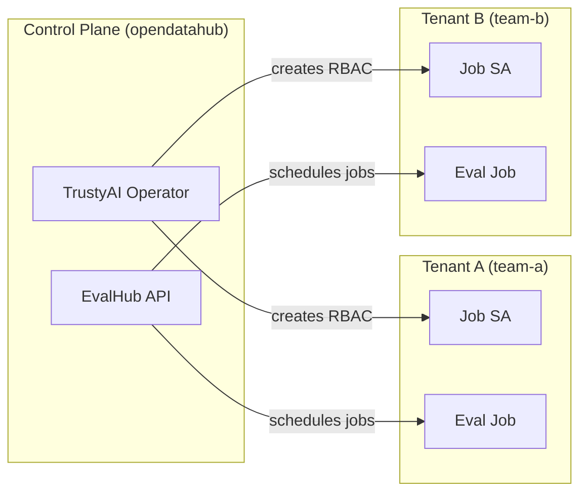
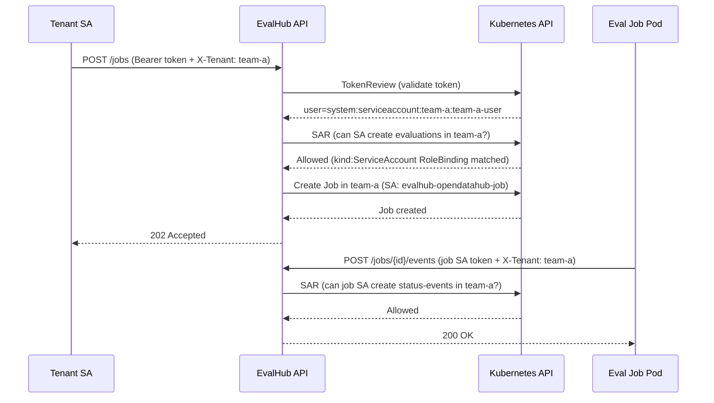
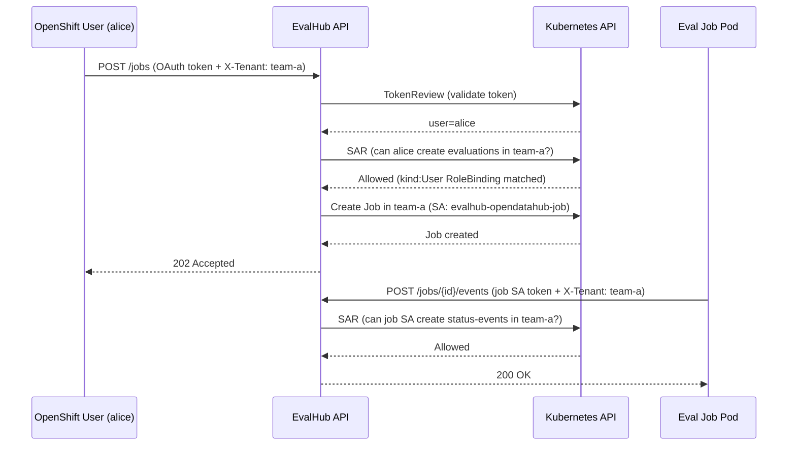
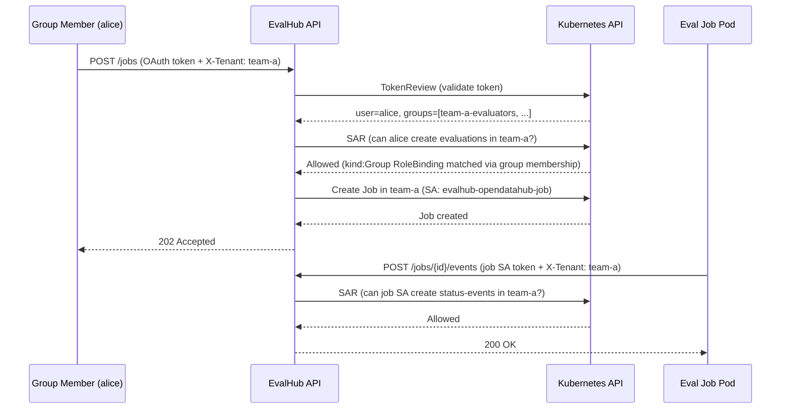

import { Steps, Tabs, TabItem } from '@astrojs/starlight/components';

Guide for deploying EvalHub with namespace-based multi-tenancy on OpenShift.

## Overview

EvalHub uses Kubernetes namespaces as tenant boundaries. Each tenant operates in its own namespace, and access is enforced through Kubernetes RBAC via SubjectAccessReview (SAR) checks.

The core principle is: **namespace = tenant = MLFlow workspace**.



### How tenant isolation works

1. **Authentication** -- Bearer tokens are validated via the Kubernetes TokenReview API. The token can belong to a ServiceAccount, an OpenShift User, or a member of an OpenShift Group — EvalHub treats all identically at this stage.
2. **Authorisation** -- Every API request includes an `X-Tenant` header specifying the target namespace. EvalHub runs a SAR check: _"can this principal perform this action in that namespace?"_
3. **Data isolation** -- All database queries are filtered by `tenant_id`
4. **Job isolation** -- Evaluation jobs run in the tenant namespace with a scoped ServiceAccount

:::note[Tenant ID and user identity are independent]
The tenant is always determined by the `X-Tenant` request header — **not** by the identity in the token. A ServiceAccount has a home namespace, but EvalHub does not use it. A real OpenShift User or Group member has no namespace at all. In all cases the caller must supply `X-Tenant` explicitly, and a matching RoleBinding (for the User, ServiceAccount, or Group) must exist in that namespace.
:::

## Prerequisites

Before setting up multi-tenancy, ensure you have:

- A working EvalHub deployment (see [OpenShift Setup](/deployment/openshift-setup/))
- Cluster-admin access (for creating namespaces and ClusterRoleBindings)
- The TrustyAI Operator installed and reconciling

## Set up

<Steps>

1. **Deploy EvalHub**

   Create an EvalHub instance in the control-plane namespace. For multi-tenancy, a persistent database is recommended:

   ```yaml
   apiVersion: trustyai.opendatahub.io/v1alpha1
   kind: EvalHub
   metadata:
     name: evalhub
     namespace: opendatahub
   spec:
     replicas: 1
     database:
       type: postgresql
       secret: evalhub-db-credentials
     providers:
       - lm-evaluation-harness
       - garak
       - garak-kfp
       - guidellm
       - lighteval
       - ibm-clear
     collections:
       - leaderboard-v2
       - safety-and-fairness-v1
       - toxicity-and-ethical-principles
   ```

   The operator automatically creates:

   | Resource | Namespace | Purpose |
   |----------|-----------|---------|
   | `evalhub-service` SA | `opendatahub` | API server identity |
   | `evalhub-opendatahub-job` SA | `opendatahub` | Jobs in the control-plane namespace |
   | ClusterRoleBinding for auth-reviewer | cluster-wide | Allows SAR and TokenReview checks |
   | RoleBindings for jobs-writer, job-config | `opendatahub` | Allows creating Jobs and ConfigMaps |

   :::note[NetworkPolicies in the EvalHub namespace]
   The namespace where the EvalHub CR is deployed (e.g. `opendatahub` in the example snippet above) may have specific NetworkPolicies that restrict traffic from other namespaces. If tenant namespaces cannot reach the EvalHub API, check the applicable NetworkPolicies and ensure tenant namespaces are explicitly allowed. For example, in the `opendatahub` namespace you may need to label tenant namespaces with:

   ```bash
   oc label namespace team-a opendatahub.io/generated-namespace=true
   ```

   Review the NetworkPolicies in the EvalHub namespace (`oc get networkpolicy -n opendatahub`) to determine the exact label required.
   :::

2. **Register tenant namespaces with the operator**

   Create a namespace for each tenant and label it so the TrustyAI Operator's **namespace watcher** provisions job resources and RBAC automatically:

   ```bash
   oc create namespace team-a
   oc create namespace team-b

   # Label each namespace as an EvalHub tenant (value can be empty or e.g. "true")
   oc label namespace team-a evalhub.trustyai.opendatahub.io/tenant=
   oc label namespace team-b evalhub.trustyai.opendatahub.io/tenant=

   # Below labels only needed when the multi-tenancy EvalHub is deployed in the `opendatahub` namespace
   oc label namespace team-a opendatahub.io/generated-namespace=true
   oc label namespace team-b opendatahub.io/generated-namespace=true
   ```

   The operator watches for namespaces with the label `evalhub.trustyai.opendatahub.io/tenant`. When it sees a labelled namespace (other than the EvalHub instance namespace), it automatically creates in that namespace:

   | Resource | Purpose |
   |----------|---------|
   | Job ServiceAccount (`{evalhub-name}-{evalhub-namespace}-job`) | Identity for evaluation job pods |
   | Job access Role + RoleBinding | Allows job pods to create `status-events` |
   | jobs-writer RoleBinding | Binds EvalHub API SA to `evalhub-jobs-writer` ClusterRole (create/delete Jobs) |
   | job-config RoleBinding | Binds EvalHub API SA to `evalhub-job-config` ClusterRole (ConfigMaps) |
   | MLFlow job RoleBinding | Binds job SA to `evalhub-mlflow-jobs-access` ClusterRole |
   | Service CA ConfigMap | For TLS callbacks from job pods to EvalHub (OpenShift service CA injection) |

   :::note[Instance namespace]
   In the **EvalHub instance namespace** (e.g. `opendatahub`), the controller also creates the `evalhub-service` SA, the job SA, all RoleBindings, and the auth-reviewer ClusterRoleBinding. You do **not** need to create these manually. Labelling the instance namespace as a tenant is unnecessary and is skipped by the watcher.
   :::

   If you remove the tenant label from a namespace, the operator will clean up the job-related resources from that namespace.

3. **Create tenant principals (users or service accounts)**

   The operator provisions the **job** ServiceAccount and RBAC in each labelled namespace. You still need to create a **tenant user** identity and bind it to evaluation permissions. This is the principal that API consumers use to authenticate when calling the EvalHub API.

   EvalHub supports three principal types:

   | Principal | Token source | RoleBinding `kind` | Has home namespace? |
   |-----------|-------------|-------------------|---------------------|
   | ServiceAccount | `oc create token` | `ServiceAccount` | Yes (where SA lives) |
   | OpenShift User | `oc whoami -t` (OAuth) | `User` | No |
   | OpenShift Group | `oc whoami -t` (OAuth, via member) | `Group` | No |

   In all cases the **tenant namespace is supplied by the caller via the `X-Tenant` header**, not inferred from the identity. A RoleBinding granting evaluation permissions must exist in that namespace.

   <Tabs>
   <TabItem label="ServiceAccount">

   Create a ServiceAccount in the tenant namespace and grant it evaluation permissions there.

   **Create the ServiceAccount:**

   ```bash
   oc apply -f - <<EOF
   apiVersion: v1
   kind: ServiceAccount
   metadata:
     name: team-a-user
     namespace: team-a
   EOF
   ```

   **Grant evaluation permissions:**

   ```bash
   oc apply -f - <<EOF
   apiVersion: rbac.authorization.k8s.io/v1
   kind: Role
   metadata:
     name: evalhub-evaluator
     namespace: team-a
   rules:
     - apiGroups: [trustyai.opendatahub.io]
       resources: [evaluations, collections, providers]
       verbs: [get, list, create, update, delete]
     - apiGroups: [mlflow.kubeflow.org]
       resources: [experiments]
       verbs: [create, get]
   ---
   apiVersion: rbac.authorization.k8s.io/v1
   kind: RoleBinding
   metadata:
     name: evalhub-evaluator-binding
     namespace: team-a
   roleRef:
     apiGroup: rbac.authorization.k8s.io
     kind: Role
     name: evalhub-evaluator
   subjects:
     - kind: ServiceAccount
       name: team-a-user
       namespace: team-a       # required for ServiceAccount subjects
   EOF
   ```

   </TabItem>

   <TabItem label="OpenShift User">

   Bind an existing OpenShift User (a human identity from the OAuth server) to evaluation permissions in the tenant namespace. No ServiceAccount needs to be created.

   **Grant evaluation permissions:**

   ```bash
   oc apply -f - <<EOF
   apiVersion: rbac.authorization.k8s.io/v1
   kind: Role
   metadata:
     name: evalhub-evaluator
     namespace: team-a
   rules:
     - apiGroups: [trustyai.opendatahub.io]
       resources: [evaluations, collections, providers]
       verbs: [get, list, create, update, delete]
     - apiGroups: [mlflow.kubeflow.org]
       resources: [experiments]
       verbs: [create, get]
   ---
   apiVersion: rbac.authorization.k8s.io/v1
   kind: RoleBinding
   metadata:
     name: evalhub-evaluator-binding
     namespace: team-a
   roleRef:
     apiGroup: rbac.authorization.k8s.io
     kind: Role
     name: evalhub-evaluator
   subjects:
     - kind: User
       name: alice             # OpenShift username (oc whoami)
       apiGroup: rbac.authorization.k8s.io
                               # no namespace field — Users are cluster-scoped
   EOF
   ```

   :::caution[Username must match exactly]
   The `name` field must match the OpenShift username as returned by `oc whoami`. The TokenReview resolves the OAuth token to this username, and the SAR engine matches it against the `kind: User` subject in the binding.
   :::

   </TabItem>

   <TabItem label="OpenShift Group">

   Bind an OpenShift Group to evaluation permissions in the tenant namespace. All members of the group inherit access without needing individual RoleBindings. This is the recommended approach for teams.

   **Create the Group and add members:**

   ```bash
   # Create the group (cluster-admin required)
   oc adm groups new team-a-evaluators

   # Add users to the group
   oc adm groups add-users team-a-evaluators alice
   oc adm groups add-users team-a-evaluators bob
   ```

   **Grant evaluation permissions to the group:**

   ```bash
   oc apply -f - <<EOF
   apiVersion: rbac.authorization.k8s.io/v1
   kind: Role
   metadata:
     name: evalhub-evaluator
     namespace: team-a
   rules:
     - apiGroups: [trustyai.opendatahub.io]
       resources: [evaluations, collections, providers]
       verbs: [get, list, create, update, delete]
     - apiGroups: [mlflow.kubeflow.org]
       resources: [experiments]
       verbs: [create, get]
   ---
   apiVersion: rbac.authorization.k8s.io/v1
   kind: RoleBinding
   metadata:
     name: evalhub-evaluator-group-binding
     namespace: team-a
   roleRef:
     apiGroup: rbac.authorization.k8s.io
     kind: Role
     name: evalhub-evaluator
   subjects:
     - kind: Group
       name: team-a-evaluators
       apiGroup: rbac.authorization.k8s.io
                               # no namespace field — Groups are cluster-scoped
   EOF
   ```

   :::note[Group membership propagation]
   After adding a user to a group, the user must re-authenticate (`oc login`) to obtain a fresh OAuth token that includes the new group membership. Existing tokens may not reflect the updated groups until they are refreshed. Allow a few seconds for RBAC propagation after creating the RoleBinding.
   :::

   :::tip[Groups vs individual Users]
   Group-based RBAC is preferred for teams because adding or removing a member from the group immediately changes their access across all namespaces where the group has a RoleBinding — no need to update individual bindings.
   :::

   </TabItem>
   </Tabs>

   :::note[Virtual resources]
   The resources in the Role (`evaluations`, `collections`, `providers`, `status-events`) are virtual -- they don't correspond to actual Kubernetes API resources. EvalHub uses them as SAR targets to enforce fine-grained access control via the Kubernetes authorisation API.
   :::

4. **Access the API with tenant scoping**

   All evaluation API requests must include the `X-Tenant` header set to the target namespace. The header is the sole source of the tenant ID — it is not derived from the token.

   **Get the EvalHub route:**

   ```bash
   EVALHUB_URL=$(oc get route evalhub -n opendatahub -o jsonpath='{.spec.host}')
   ```

   **Get a token:**

   <Tabs>
   <TabItem label="ServiceAccount">

   ```bash
   TOKEN=$(oc create token team-a-user -n team-a --duration=1h)
   ```

   The TokenReview will resolve this to `system:serviceaccount:team-a:team-a-user`.

   </TabItem>

   <TabItem label="OpenShift User">

   ```bash
   # Log in as the user first (if not already)
   oc login --username=alice --password=<password>

   TOKEN=$(oc whoami -t)
   ```

   The TokenReview will resolve this to `alice` (the plain OpenShift username).

   :::caution[Use `oc whoami -t`, not `oc create token`]
   `oc create token` always creates a ServiceAccount token, even when run as a logged-in user. To get an OAuth token for a real OpenShift User, use `oc whoami -t` after logging in.
   :::

   </TabItem>

   <TabItem label="OpenShift Group">

   ```bash
   # Log in as a user who is a member of the group
   oc login --username=alice --password=<password>

   TOKEN=$(oc whoami -t)
   ```

   The TokenReview resolves this to `alice`, and the SAR check matches the `kind: Group` RoleBinding because the token includes group membership claims. The flow is identical to the User case — the only difference is which RoleBinding subject kind is matched.

   </TabItem>
   </Tabs>

   **List providers (scoped to team-a):**

   <Tabs syncKey="interface">
   <TabItem label="CLI">

   ```bash
   evalhub providers list --token $TOKEN --tenant team-a
   ```

   </TabItem>
   <TabItem label="Python SDK">

   ```python
   team_a = SyncEvalHubClient(
       base_url=os.environ["EVALHUB_URL"],
       auth_token=TOKEN,
       tenant="team-a"
   )
   providers = team_a.providers.list()
   ```

   </TabItem>
   <TabItem label="REST API">

   ```bash
   curl -sS -k \
     -H "Authorization: Bearer $TOKEN" \
     -H "X-Tenant: team-a" \
     "https://$EVALHUB_URL/api/v1/evaluations/providers" | jq .
   ```

   </TabItem>
   </Tabs>

   **Submit an evaluation job:**

   <Tabs syncKey="interface">
   <TabItem label="CLI">

   ```bash
   evalhub eval run \
     --token $TOKEN \
     --tenant team-a \
     --name mmlu-eval \
     --model-url http://vllm-server.team-a.svc.cluster.local:8000/v1 \
     --model-name meta-llama/Llama-3.2-1B-Instruct \
     --provider lm_evaluation_harness \
     --benchmark mmlu
   ```

   </TabItem>
   <TabItem label="Python SDK">

   ```python
   job = team_a.jobs.submit(JobSubmissionRequest(
       name="mmlu-eval",
       model=ModelConfig(
           url="http://vllm-server.team-a.svc.cluster.local:8000/v1",
           name="meta-llama/Llama-3.2-1B-Instruct"
       ),
       benchmarks=[
           BenchmarkConfig(id="mmlu", provider_id="lm_evaluation_harness")
       ]
   ))
   ```

   </TabItem>
   <TabItem label="REST API">

   ```bash
   curl -sS -k -X POST \
     -H "Authorization: Bearer $TOKEN" \
     -H "X-Tenant: team-a" \
     -H "Content-Type: application/json" \
     -d '{
       "model": {
         "url": "http://vllm-server.team-a.svc.cluster.local:8000/v1",
         "name": "meta-llama/Llama-3.2-1B-Instruct"
       },
       "benchmarks": [
         {
           "id": "mmlu",
           "provider_id": "lm_evaluation_harness"
         }
       ]
     }' \
     "https://$EVALHUB_URL/api/v1/evaluations/jobs" | jq .
   ```

   </TabItem>
   </Tabs>

   The job pod will be created in the `team-a` namespace using the `evalhub-opendatahub-job` ServiceAccount, regardless of which principal type submitted the request.

   **Cross-tenant access is denied:**

   <Tabs syncKey="interface">
   <TabItem label="CLI">

   ```bash
   # This will return an error — no access to team-b
   evalhub eval status --token $TOKEN --tenant team-b
   ```

   </TabItem>
   <TabItem label="Python SDK">

   ```python
   # This will raise an HTTP 403 error
   team_b = SyncEvalHubClient(
       base_url=os.environ["EVALHUB_URL"],
       auth_token=TOKEN,
       tenant="team-b"
   )
   team_b.jobs.list()  # 403 Forbidden
   ```

   </TabItem>
   <TabItem label="REST API">

   ```bash
   # This will return 403 Forbidden
   curl -sS -k -X GET \
     -H "Authorization: Bearer $TOKEN" \
     -H "X-Tenant: team-b" \
     "https://$EVALHUB_URL/api/v1/evaluations/jobs"
   ```

   </TabItem>
   </Tabs>

   The SAR check fails because the principal (whether a ServiceAccount or a User) has no RoleBinding in the `team-b` namespace.

</Steps>

## Authorisation model

EvalHub uses an embedded SAR authoriser. The auth config (`config/auth.yaml`) maps API endpoints to Kubernetes resource attributes:

| Endpoint | Resource | Verb | Namespace source |
|----------|----------|------|------------------|
| `POST /api/v1/evaluations/jobs` | `evaluations` | `create` | `X-Tenant` header |
| `GET /api/v1/evaluations/jobs` | `evaluations` | `get` | `X-Tenant` header |
| `POST /api/v1/evaluations/jobs/*/events` | `status-events` | `create` | `X-Tenant` header |
| `* /api/v1/evaluations/collections` | `collections` | _(from HTTP method)_ | `X-Tenant` header |
| `* /api/v1/evaluations/providers` | `providers` | _(from HTTP method)_ | `X-Tenant` header |

For `POST /api/v1/evaluations/jobs`, two additional SAR checks are performed for MLFlow access (`mlflow.kubeflow.org/experiments` with `create` and `get` verbs).

### Request flow

The flow is identical for both principal types. The only difference is what the TokenReview returns and which subject kind is matched in the RoleBinding.

<Tabs>
<TabItem label="ServiceAccount">



</TabItem>

<TabItem label="OpenShift User">



</TabItem>

<TabItem label="OpenShift Group">



</TabItem>
</Tabs>

Note that the job pod always runs as the operator-provisioned job ServiceAccount (`evalhub-opendatahub-job`), regardless of whether the submitter was a User, Group member, or a ServiceAccount.

## RBAC reference

### ClusterRoles (installed by operator)

| ClusterRole | Purpose | Key permissions |
|-------------|---------|-----------------|
| `evalhub-auth-reviewer-role` | Token and SAR validation | `tokenreviews`, `subjectaccessreviews` |
| `evalhub-jobs-writer` | Create evaluation jobs | `batch/jobs` (create, delete) |
| `evalhub-job-config` | Manage job config | `configmaps` (create, get, update, delete) |
| `evalhub-providers-access` | Providers endpoint SAR | `providers` (get) |
| `evalhub-collections-access` | Collections endpoint SAR | `collections` (get) |
| `evalhub-mlflow-access` | API server MLFlow access | `experiments` (create, get, list, update, delete) |
| `evalhub-mlflow-jobs-access` | Job pod MLFlow access | `experiments` (create, get, list) |

### Per-tenant resources (operator-provisioned)

For each namespace labelled with `evalhub.trustyai.opendatahub.io/tenant`, the operator creates:

| Resource | Name pattern | Purpose |
|----------|-------------|---------|
| ServiceAccount | `{name}-{evalhub-ns}-job` | Identity for job pods |
| Role | `{name}-{evalhub-ns}-job-access-role` | Allows `status-events/create` |
| RoleBinding | `{name}-{evalhub-ns}-job-access-rb` | Binds job SA to access Role |
| RoleBinding | `{name}-{tenant-ns}-job-writer-rb` | Binds API SA to jobs-writer ClusterRole |
| RoleBinding | `{name}-{tenant-ns}-job-config-rb` | Binds API SA to job-config ClusterRole |
| RoleBinding | `{name}-{evalhub-ns}-mlflow-job-rb` | Binds job SA to MLFlow ClusterRole |
| ConfigMap | `{name}-service-ca` | Service CA for TLS (OpenShift) |

### ServiceAccount naming

The job SA name includes the EvalHub instance namespace to prevent collisions when multiple EvalHub instances (potentially with the same CR name in different namespaces) create jobs in the same tenant namespace:

```
{evalhub-cr-name}-{evalhub-namespace}-job
```

For example, an EvalHub CR named `evalhub` in namespace `opendatahub` produces:

```
evalhub-opendatahub-job
```

## Verifying the setup

### Check operator-provisioned resources

After labelling a namespace with `evalhub.trustyai.opendatahub.io/tenant`, the operator should create the job SA and RoleBindings within a short time. Verify:

```bash
# Ensure the namespace has the tenant label
oc get namespace team-a --show-labels | grep evalhub.trustyai.opendatahub.io/tenant

# Verify job SA exists in tenant namespace (created by operator)
oc get sa evalhub-opendatahub-job -n team-a

# Verify RoleBindings (created by operator)
oc get rolebindings -n team-a | grep evalhub
```

Test permissions for the tenant principal:

<Tabs>
<TabItem label="ServiceAccount">

```bash
# Test access in own tenant namespace
oc auth can-i create evaluations.trustyai.opendatahub.io \
  -n team-a \
  --as=system:serviceaccount:team-a:team-a-user

# Test cross-tenant denial
oc auth can-i create evaluations.trustyai.opendatahub.io \
  -n team-b \
  --as=system:serviceaccount:team-a:team-a-user
```

</TabItem>

<TabItem label="OpenShift User">

```bash
# Test access in own tenant namespace
oc auth can-i create evaluations.trustyai.opendatahub.io \
  -n team-a \
  --as=alice

# Test cross-tenant denial
oc auth can-i create evaluations.trustyai.opendatahub.io \
  -n team-b \
  --as=alice
```

</TabItem>

<TabItem label="OpenShift Group">

```bash
# Test access via group membership (using --as-group)
oc auth can-i create evaluations.trustyai.opendatahub.io \
  -n team-a \
  --as=alice --as-group=team-a-evaluators

# Test cross-tenant denial
oc auth can-i create evaluations.trustyai.opendatahub.io \
  -n team-b \
  --as=alice --as-group=team-a-evaluators

# Verify group membership
oc get group team-a-evaluators -o jsonpath='{.users[*]}'
```

</TabItem>
</Tabs>

### Check job execution

```bash
# List jobs in tenant namespace
oc get jobs -n team-a -l app.kubernetes.io/part-of=eval-hub

# Check job pod SA
oc get pod -n team-a -l app.kubernetes.io/part-of=eval-hub \
  -o jsonpath='{.items[0].spec.serviceAccountName}'
# Expected: evalhub-opendatahub-job
```

## Troubleshooting

### 403 Forbidden on API calls

The SAR check is failing. Verify:

1. The `X-Tenant` header matches a namespace where the principal has a RoleBinding
2. The Role includes the correct resources and verbs
3. The RoleBinding `subjects[].kind` matches the principal type (`ServiceAccount`, `User`, or `Group`)

<Tabs>
<TabItem label="ServiceAccount">

```bash
oc auth can-i create evaluations.trustyai.opendatahub.io \
  -n team-a \
  --as=system:serviceaccount:team-a:team-a-user -v=6
```

</TabItem>

<TabItem label="OpenShift User">

```bash
oc auth can-i create evaluations.trustyai.opendatahub.io \
  -n team-a \
  --as=alice -v=6
```

Also confirm the RoleBinding subject kind is `User` and has no `namespace` field:

```bash
oc get rolebinding evalhub-evaluator-binding -n team-a -o yaml | grep -A5 subjects
```

</TabItem>

<TabItem label="OpenShift Group">

```bash
oc auth can-i create evaluations.trustyai.opendatahub.io \
  -n team-a \
  --as=alice --as-group=team-a-evaluators -v=6
```

If the SAR check passes with `--as-group` but real requests still fail:

1. **Token doesn't include group claims** -- The user must re-login (`oc login`) after being added to the group. Existing OAuth tokens may not include the new group membership.
2. **Verify group membership:**

    ```bash
    oc get group team-a-evaluators -o jsonpath='{.users[*]}'
    ```

3. **Confirm the RoleBinding subject kind is `Group`:**

    ```bash
    oc get rolebinding evalhub-evaluator-group-binding -n team-a -o yaml | grep -A5 subjects
    ```

</TabItem>
</Tabs>

### Jobs not created in tenant namespace

Verify the EvalHub API SA has the `jobs-writer` and `job-config` RoleBindings in the tenant namespace:

```bash
oc get rolebindings -n team-a -o wide | grep -E "jobs-writer|job-config"
```

### Job pods failing to post status events

The job SA needs the `status-events/create` permission in the tenant namespace:

```bash
oc auth can-i create status-events.trustyai.opendatahub.io \
  -n team-a \
  --as=system:serviceaccount:team-a:evalhub-opendatahub-job
```
