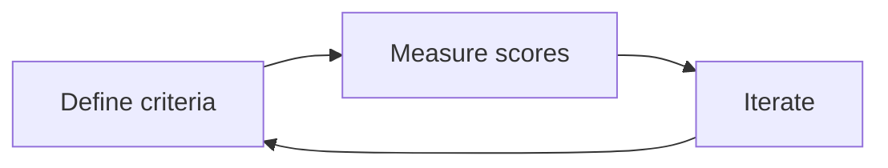

import { Card, CardGrid, LinkCard, Steps } from '@astrojs/starlight/components';

Evaluation-Driven Development (EDD) is the AI equivalent of Test-Driven Development (TDD). Instead of writing unit tests before code, you define evaluation criteria before deploying or fine-tuning a model. EvalHub's [agent metadata](/mcp/agent-discoverability/) powers each phase of the cycle — agents discover what to measure, construct valid jobs, and interpret results without hardcoded knowledge.

See also the animated [MCP EDD Workflow](/images/diagrams/eval-hub-mcp-edd-flow.html) diagram on the Home page and the [`edd_workflow` MCP prompt](/mcp/prompts/#edd_workflow).

## The EDD cycle



| Phase | Goal | Agent metadata used |
| ----- | ---- | ------------------- |
| **Define** | Choose the right evaluations and set thresholds | `evaluates`, `recommended_when`, `target_type` |
| **Measure** | Run evaluations and capture scores | `hints`, collection pass thresholds |
| **Iterate** | Improve the model and re-evaluate | `result_interpretation`, `score_ranges`, `complements` |

## Phase 1: Define criteria

Discover evaluations that match the user's goals. Never assume provider or collection IDs exist — always fetch live metadata from the API.

<Steps>

1. **Match user intent to `evaluates` tags**

   ```bash
   export EVALHUB_BASE_URL="https://evalhub.apps.my-cluster.example.com"
   export EVALHUB_TOKEN="$(oc whoami -t)"
   export EVALHUB_TENANT="eval-test"
   ```

   Filter providers by capability:

   ```python
   import os
   from evalhub import SyncEvalHubClient

   with SyncEvalHubClient(
       base_url=os.environ["EVALHUB_BASE_URL"],
       auth_token=os.environ["EVALHUB_TOKEN"],
       tenant=os.environ["EVALHUB_TENANT"],
   ) as client:
       safety_providers = client.providers.list(evaluates="safety")
       for p in safety_providers:
           if p.agent:
               print(p.resource.id, "—", p.agent.summary)
   ```

   Or via MCP: call `discover_providers` with `{"evaluates": ["safety"]}`.

2. **Filter by target type**

   If you know what the user is evaluating:

   ```python
   agent_providers = client.providers.list(target_type="agent")
   model_providers = client.providers.list(target_type="model")
   perf_providers = client.providers.list(target_type="inference_server")
   ```

3. **Confirm with `recommended_when`**

   Read the provider's `recommended_when` strings to verify the match. These are natural-language conditions written for LLM consumption.

4. **Set thresholds**

   - Read `result_interpretation` for metric direction and baselines (e.g. Garak: lower `attack_success_rate` is better; scores above 0.3 indicate vulnerability)
   - Check benchmark `score_ranges` when available (e.g. `"0.0-0.25"` = below random chance for 4-choice MCQ)
   - Start conservatively; tighten thresholds as the model improves

</Steps>

:::tip
For broad intents like "evaluate safety" or "assess fairness", prefer a **collection** over individual benchmarks. Collections have curated weights and pass thresholds — see [Agent Discoverability](/mcp/agent-discoverability/#collections-vs-individual-benchmarks).
:::

## Phase 2: Measure scores

Run the evaluation using IDs discovered in Phase 1. Read `hints` before constructing the job request.

<Steps>

1. **Read operational hints**

   ```python
   provider = client.providers.get("garak")
   if provider.agent:
       for hint in provider.agent.hints:
           print(hint)
   ```

   Example hints for Garak:
   - The model endpoint must support OpenAI-compatible chat completions
   - Use the `quick` benchmark for a fast smoke test (~2 minutes)

2. **Submit the evaluation**

   ```python
   from evalhub.models.api import (
       BenchmarkConfig,
       JobSubmissionRequest,
       ModelConfig,
   )

   job = client.jobs.submit(JobSubmissionRequest(
       name="edd-safety-baseline",
       model=ModelConfig(
           url="http://vllm:8000/v1",
           name="mistral-7b-instruct",
       ),
       benchmarks=[BenchmarkConfig(id="quick", provider_id="garak")],
   ))
   result = client.jobs.wait_for_completion(job.id, timeout=3600)
   ```

   Or submit a collection for a comprehensive assessment:

   ```python
   from evalhub.models.api import CollectionConfig, JobSubmissionRequest, ModelConfig

   job = client.jobs.submit(JobSubmissionRequest(
       name="edd-safety-suite",
       model=ModelConfig(url="http://vllm:8000/v1", name="mistral-7b-instruct"),
       collection=CollectionConfig(id="safety-and-fairness-v1"),
   ))
   ```

3. **Interpret results using agent metadata**

   After the job completes, use `result_interpretation` to explain scores:

   | Metric | Value | Interpretation |
   | ------ | ----- | -------------- |
   | `attack_success_rate` | 0.15 | Lower is better; above 0.3 indicates significant vulnerability |
   | Collection aggregate | 0.82 | Weighted average; pass threshold for Safety & Fairness v1 is 0.758 |

   The MCP `get_job_status` tool enriches completed benchmarks with `result_interpretation` and `complements` from provider agent metadata.

</Steps>

## Phase 3: Iterate

If thresholds are not met, improve the model and re-evaluate. Tag each run (e.g. `edd-iteration-1`, `edd-iteration-2`) so you can compare in MLflow.

**Iteration strategies:**

1. **Prompt engineering** — adjust system prompts, few-shot examples
2. **Fine-tuning** — additional training on domain-specific data
3. **Model selection** — try a different base model
4. **RAG improvements** — better retrieval, re-ranking, chunking
5. **Safety guardrails** — add or tune content filters

After each iteration, check `complements` for follow-up evaluations. For example, after a Garak safety scan, `complements: [lm_evaluation_harness, guidellm]` suggests running accuracy benchmarks and throughput profiling.

## Worked example: safety EDD

**Context:** A developer is refactoring safety guardrails on a chat model and wants to measure impact before and after.

**Define:**

Use the `edd_workflow` MCP prompt with `application_type: safety`, or discover manually:

```python
providers = client.providers.list(evaluates="safety", target_type="model")
# Recommend: garak (red-teaming) + safety-and-fairness-v1 collection (bias, toxicity, ethics)
```

**Measure (before):**

Run Garak `quick` benchmark and the Safety & Fairness collection. Record baseline scores.

**Iterate:**

Developer refactors guardrails.

**Measure (after):**

Re-run the same evaluations. Compare:
- Garak `attack_success_rate` — should not increase
- Collection aggregate score — should remain above 0.758
- Individual benchmark scores — check `result_interpretation` for per-metric guidance

**Agent response example:**

> Your guardrail refactor improved the Garak attack success rate from 0.22 to 0.15 (lower is better). The Safety & Fairness collection aggregate rose from 0.76 to 0.82, now above the 0.758 pass threshold. The `toxigen` benchmark improved most — toxicity avoidance is stronger. Consider running `lm_evaluation_harness` next (listed in `complements`) to check whether accuracy regressed.

## Using the MCP edd_workflow prompt

The [`edd_workflow`](/mcp/prompts/#edd_workflow) prompt provides structured guidance for each application type:

| Type | Define | Measure | Iterate |
| ---- | ------ | ------- | ------- |
| `rag` | Retrieval quality and generation accuracy targets | RAG-specific benchmarks | Retrieval pipeline and generation prompts |
| `agent` | Task completion and tool use accuracy | Tool call correctness and task success rate | Agent prompts and guardrails |
| `safety` | Safety requirements and acceptable thresholds | Toxicity, bias, harmful content | Safety guardrails and content filters |
| `classifier` | Per-class accuracy targets | Class imbalance and edge cases | Classification prompts and examples |

Ask your AI agent:

```text
Use the edd_workflow prompt for a safety application
```

The agent receives a structured Define → Measure → Iterate workflow and uses EvalHub tools and [agent metadata](/mcp/agent-discoverability/) to execute each phase.

## Related

<CardGrid>
  <LinkCard title="Agent Discoverability" href="/mcp/agent-discoverability/" description="Metadata model and discovery APIs" />
  <LinkCard title="MCP Prompts" href="/mcp/prompts/" description="edd_workflow, evaluate_model, compare_runs" />
  <LinkCard title="Agent Skills" href="/mcp/skills/" description="Skill scripts for discovery and EDD workflows" />
  <LinkCard title="MCP Tools" href="/mcp/tools/" description="submit_evaluation and get_job_status" />
</CardGrid>
