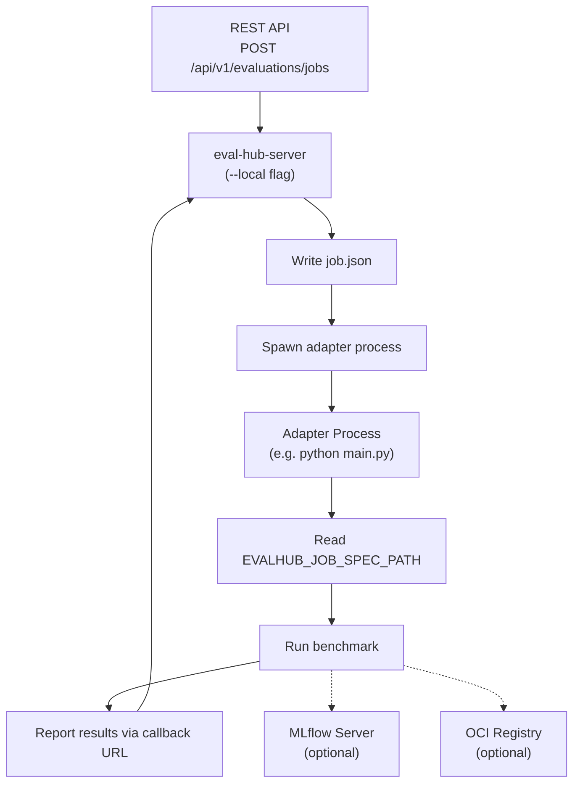

Local mode runs the full EvalHub evaluation pipeline on your workstation without a Kubernetes cluster. Activate it with the `--local` flag. The REST API is identical to cluster mode — the same endpoints, request bodies, and response schemas apply.

Local mode is useful for:

- Developing and testing evaluation adapters before deploying to a cluster
- Running evaluations against locally-served models (Ollama, llama.cpp, vLLM)
- Iterating on benchmark configurations without infrastructure overhead
- Debugging the end-to-end evaluation flow

For a hands-on walkthrough, see the [Local Mode Tutorial](/guides/local-mode-tutorial/).

## Starting the Server in Local Mode

```bash
pip install eval-hub-server
eval-hub-server --version
```

The server requires a `--configdir` pointing to a directory containing a server `config.yaml` and a `providers/` subdirectory with provider YAML files (see the [Local Mode Tutorial](/guides/local-mode-tutorial/) for a step-by-step setup). The `--local` flag disables authentication and enables CORS. The server starts at `http://localhost:8080` with SQLite in-memory storage.

```bash
eval-hub-server --local --configdir ./config
```

**Custom port:**

```bash
PORT=8090 eval-hub-server --local --configdir ./config
```

**With MLflow tracking:**

```bash
MLFLOW_TRACKING_URI=http://localhost:5000 eval-hub-server --local --configdir ./config
```

## Differences from Cluster Mode

| Aspect | Cluster mode | Local mode |
|---|---|---|
| **Job execution** | Kubernetes Jobs (containers) | Host subprocesses (`sh -c "<command>"`) |
| **Authentication** | Enabled (configurable) | Disabled automatically |
| **Multi-tenancy** | Tenant isolation via `X-Tenant` header | Single-tenant only |
| **CORS** | Disabled by default | Enabled |
| **Sidecar proxy** | Injected into job pods | Not used; adapters call services directly |
| **Init container** | Downloads test data to `/test_data` | Not used |
| **Job scheduling (Kueue)** | Supported via `queue` config | Ignored |
| **Process isolation** | Container sandbox per job | Shared host environment |
| **Provider runtime config** | `runtime.k8s` (image, entrypoint, resources) | `runtime.local` (command, env vars) |

## How Local Job Execution Works

When an evaluation job is submitted in local mode, for each benchmark the server:

1. Writes a **job specification** (`job.json`) to `/tmp/evalhub-jobs/<job_id>/<benchmark_index>/<provider_id>/<benchmark_id>/meta/`
2. Spawns the provider's `runtime.local.command` as a shell process, passing the job spec path via the `EVALHUB_JOB_SPEC_PATH` environment variable
3. Captures stdout/stderr to `jobrun.log` alongside the job spec
4. Tracks subprocess PIDs for cancellation (kills the entire process group on cancel)
5. The adapter reads the job spec, runs the benchmark, and reports results back via the callback URL



### Job file layout

```text
/tmp/evalhub-jobs/
└── <job_id>/
    └── <benchmark_index>/
        └── <provider_id>/
            └── <benchmark_id>/
                ├── meta/
                │   └── job.json        # Job specification for the adapter
                └── jobrun.log          # Stdout/stderr from the adapter process
```

### Job specification (job.json)

The job specification is the same structure used in cluster mode (where it is mounted into the container as a ConfigMap). It contains all the information the adapter needs to run the benchmark:

```json
{
  "id": "<job_id>",
  "provider_id": "<provider_id>",
  "benchmark_id": "<benchmark_id>",
  "benchmark_index": 0,
  "model": {
    "url": "http://localhost:11434/v1",
    "name": "llama3.2:3b-instruct-q4_K_M"
  },
  "num_examples": 10,
  "parameters": {},
  "experiment_name": "my-experiment",
  "tags": [
    { "key": "model", "value": "llama3.2:3b-instruct-q4_K_M" }
  ],
  "callback_url": "http://localhost:8080",
  "exports": {
    "oci": {
      "coordinates": {
        "oci_host": "localhost:5001",
        "oci_repository": "eval-results"
      }
    }
  }
}
```

:::note[OCI registry credentials]
In local mode, the OCI persister reads credentials from `~/.docker/config.json`. If your OCI registry requires authentication, run [`docker login`](https://docs.docker.com/reference/cli/docker/login/) (or `podman login`) before starting an evaluation. For local registries without authentication, set `OCI_INSECURE=true` in the provider's `runtime.local.env` instead.
:::

## Provider Configuration for Local Mode

Each provider must have a `runtime.local` section specifying the adapter command and optional environment variables. The `runtime.local.command` is executed via `sh -c "<command>"`.

```yaml
id: my-provider
name: My Evaluation Provider
description: Custom evaluation framework adapter
runtime:
  local:
    command: "python main.py"
    env:
      - name: OCI_INSECURE
        value: "true"

benchmarks:
  - id: my_benchmark
    name: My benchmark
    description: Description of what this benchmark measures
    category: reasoning
    metrics:
      - acc
    primary_score:
      metric: acc
      lower_is_better: false
    pass_criteria:
      threshold: 0.25
```

A provider configuration can include both `runtime.local` and `runtime.k8s` sections, allowing the same definition to work in both modes.

:::tip[Alternative: REST API]
YAML files are convenient for quick iterations and edits during local development. Alternatively, you can register providers via the REST API (`POST /api/v1/evaluations/providers`) after the server is running — this mirrors the workflow used in cluster deployments, making it easier to onboard providers consistently across environments. When using the REST API, use the returned provider UUID as the `--provider` value in `evalhub eval run`. See the [Local Mode Tutorial](/guides/local-mode-tutorial/) for a complete example.
:::

### Environment variables

The adapter process receives the following environment variables:

| Variable | Description |
|---|---|
| `EVALHUB_JOB_SPEC_PATH` | Absolute path to the `job.json` file |
| Custom env vars from `runtime.local.env` | Any additional variables defined in the provider config |

See [System Overview — AdapterSettings](/architecture/system-overview/#adaptersettings) for the complete list of adapter environment variables.

## Writing Adapters for Both Modes

Adapters that need to work in both cluster and local mode should use a common pattern for resolving the output directory. In cluster mode the adapter writes results relative to its own directory; in local mode the job base path is available and results go under it:

```python
if self.local_jobs_base_path is not None:
    output_dir = self.local_jobs_base_path / "results"
else:
    output_dir = Path(__file__).parent / "results"
```

See the [LightEval adapter source](https://github.com/eval-hub/eval-hub-contrib/blob/main/adapters/lighteval/main.py) for a working example.

## Troubleshooting

### Adapter process logs

Check the adapter process output in the job log file:

```bash
cat /tmp/evalhub-jobs/<job_id>/<benchmark_index>/<provider_id>/<benchmark_id>/jobrun.log
```

### Server logs

The server logs structured JSON to stderr. Look for `local runtime` messages:

- `local runtime job spec written` — job spec was created successfully
- `local runtime process started` — adapter process was launched with the logged PID and command
- `local runtime benchmark launch failed` — adapter command failed to start

### Common issues

| Symptom | Cause | Fix |
|---|---|---|
| Job fails immediately | Adapter command not found | Verify `runtime.local.command` path and that dependencies are installed |
| Job stays in `running` state | Adapter is not reporting back | Check the adapter logs in `jobrun.log`; verify the callback URL is reachable |
| `provider has no local runtime configured` | Missing `runtime.local` in provider YAML | Add a `runtime.local.command` to the provider configuration |
| MLflow experiment not created | MLflow not configured | Set `MLFLOW_TRACKING_URI` or `mlflow.tracking_uri` in `config.yaml` |
| OCI push fails | Registry not reachable or requires auth | Verify the registry is running; run `docker login`/`podman login` for authenticated registries or set `OCI_INSECURE=true` for local ones |
