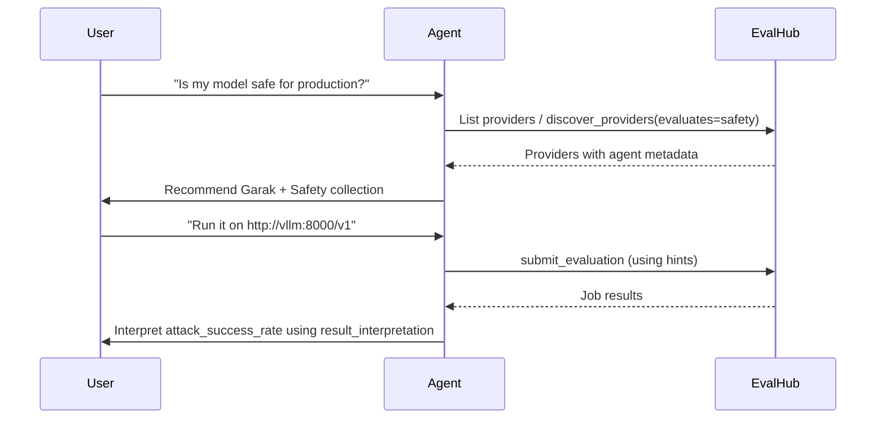

import { Card, CardGrid, LinkCard, Tabs, TabItem } from '@astrojs/starlight/components';
import Since from '../../../components/Since.astro';

<Since version="0.4.2" />

<br /><br />

EvalHub embeds structured **agent metadata** on providers, benchmarks, and collections so AI coding agents can discover the right evaluation, construct valid job requests, and interpret results — without hardcoded provider lists or deep API knowledge. The metadata lives inline on existing REST resources as optional JSON (or YAML in provider configs), and is available through the [Python SDK](/reference/sdk-client/), [MCP server](/mcp/), and [Agent Skills](/mcp/skills/).

:::note
`agent` blocks are optional and backwards-compatible. Bundled provider YAML is being populated with metadata; live clusters may return `"agent": null` until configs are updated.
:::

## What agents need

Agents working with EvalHub follow a three-step loop:



1. **Discover** — match user intent to `evaluates` tags and `recommended_when` conditions
2. **Execute** — read `hints` before submitting a job
3. **Interpret** — use `result_interpretation` and benchmark `score_ranges` to explain scores

The [MCP server](/mcp/) exposes this loop through tools (`discover_providers`, `submit_evaluation`, `get_job_status`) and resources (`evalhub://providers`). See [Evaluation-Driven Development](/guides/evaluation-driven-development/) for the full Define → Measure → Iterate workflow.

## The `agent` metadata model

Metadata appears as an optional `agent` object on provider, benchmark, and collection responses.

### Provider-level fields

| Field | Type | Description |
| ----- | ---- | ----------- |
| `evaluates` | `string[]` | Semantic tags describing what this provider measures (e.g. `safety`, `reasoning`, `throughput`). Agents match these against user intent. |
| `recommended_when` | `string[]` | Natural-language conditions under which an agent should suggest this provider. |
| `target_type` | `string` | What the provider evaluates: `model`, `agent`, or `inference_server`. |
| `summary` | `string` | Concise, action-oriented description (max 200 chars). |
| `complements` | `string[]` | Provider IDs that pair well for follow-up evaluations. |
| `hints` | `string[]` | Operational guidance for constructing job requests — model naming, secrets, parameter gotchas. |
| `result_interpretation` | `string[]` | How to read results — metric direction, baselines, what "good" looks like. |

### Benchmark-level fields

Benchmarks can override provider defaults with a nested `agent` block:

| Field | Type | Description |
| ----- | ---- | ----------- |
| `result_interpretation` | `string` | Benchmark-specific guidance overriding provider defaults. |
| `score_ranges` | `object[]` | Structured score bands with semantic meaning (e.g. `"0.0-0.25"` = below random chance). Each entry has `range` and `meaning`. |

### Collection-level fields

Collections use the same fields as providers except `target_type` (collections aggregate benchmarks across providers that may target different types):

| Field | Type | Description |
| ----- | ---- | ----------- |
| `evaluates` | `string[]` | What dimensions this collection assesses. |
| `recommended_when` | `string[]` | When to suggest this collection over individual benchmarks. |
| `summary` | `string` | Concise description for agent tool listings. |
| `complements` | `string[]` | Collection or provider IDs that pair well. |
| `hints` | `string[]` | Operational guidance (duration, resource requirements). |
| `result_interpretation` | `string[]` | How to interpret aggregate and per-benchmark scores. |

Full schemas are available in the OpenAPI specification served at `/openapi.yaml` on any EvalHub instance.

## Where metadata lives

There is no dedicated discovery endpoint. Metadata is returned on existing API routes:

| Endpoint | Agent metadata |
| -------- | -------------- |
| `GET /api/v1/evaluations/providers` | `agent` on each provider; nested `agent` on benchmarks |
| `GET /api/v1/evaluations/providers/{id}` | Same |
| `GET /api/v1/evaluations/collections` | `agent` when configured |
| `GET /api/v1/evaluations/collections/{id}` | Same |

Provider metadata can be updated at runtime via `PATCH /api/v1/evaluations/providers/{id}` with paths under `/agent`.

## How to discover

Set up your environment once:

```bash
export EVALHUB_BASE_URL="https://evalhub.apps.my-cluster.example.com"
export EVALHUB_TOKEN="$(oc whoami -t)"
export EVALHUB_TENANT="eval-test"
```

**Scenario:** a developer asks *"Is my model safe for production?"*

<Tabs syncKey="interface">
<TabItem label="REST">

```bash
curl -s \
  -H "Authorization: Bearer $EVALHUB_TOKEN" \
  -H "X-Tenant: $EVALHUB_TENANT" \
  "$EVALHUB_BASE_URL/api/v1/evaluations/providers" \
  | jq '[.items[] | select(.agent != null and (.agent.evaluates | index("safety"))) |
    {id: .resource.id, summary: .agent.summary, hints: .agent.hints}]'
```

Example output:

```json
[
  {
    "id": "garak",
    "summary": "Red-team an LLM for safety vulnerabilities, toxicity, and OWASP risks",
    "hints": [
      "The model endpoint must support OpenAI-compatible chat completions",
      "The 'quick' benchmark runs a single DAN probe for fast smoke testing (~2 min)"
    ]
  }
]
```

List collections with safety metadata:

```bash
curl -s \
  -H "Authorization: Bearer $EVALHUB_TOKEN" \
  -H "X-Tenant: $EVALHUB_TENANT" \
  "$EVALHUB_BASE_URL/api/v1/evaluations/collections" \
  | jq '[.items[] | select(.agent != null and (.agent.evaluates | index("safety"))) |
    {id: .resource.id, summary: .agent.summary}]'
```

</TabItem>
<TabItem label="Python SDK">

```python
import os
from evalhub import SyncEvalHubClient

with SyncEvalHubClient(
    base_url=os.environ["EVALHUB_BASE_URL"],
    auth_token=os.environ["EVALHUB_TOKEN"],
    tenant=os.environ["EVALHUB_TENANT"],
) as client:
    for p in client.providers.list(evaluates="safety", target_type="model"):
        if p.agent:
            print(f"{p.resource.id} — {p.agent.summary}")
            for hint in p.agent.hints:
                print(f"  hint: {hint}")
```

:::note
`client.providers.list(target_type=, evaluates=)` filters **client-side** after fetching all providers. The CLI does not expose these filter flags yet — use the SDK directly or [Agent Skills](/mcp/skills/).
:::

</TabItem>
<TabItem label="MCP">

Call the `discover_providers` tool with filters:

```json
{
  "evaluates": ["safety"],
  "target_type": "model"
}
```

Example response:

```json
{
  "providers": [
    {
      "id": "garak",
      "name": "garak",
      "title": "Garak",
      "summary": "Red-team an LLM for safety vulnerabilities, toxicity, and OWASP risks",
      "target_type": "model",
      "evaluates": ["safety", "security", "red_teaming", "toxicity"],
      "hints": [
        "The model endpoint must support OpenAI-compatible chat completions",
        "The 'quick' benchmark runs a single DAN probe for fast smoke testing (~2 min)"
      ],
      "result_interpretation": [
        "attack_success_rate measures how often the model was successfully exploited",
        "LOWER is better -- 0.0 means no attacks succeeded",
        "Scores above 0.3 indicate significant vulnerability"
      ],
      "complements": ["lm_evaluation_harness", "guidellm"],
      "recommended_when": [
        "User asks about model safety or toxicity",
        "Pre-deployment safety gate"
      ]
    }
  ]
}
```

Alternatively, read the `evalhub://providers` resource and filter client-side. Prefer `discover_providers` when you need structured, filtered summaries.

See [MCP Tools — discover_providers](/mcp/tools/#discover_providers) for parameter details.

</TabItem>
</Tabs>

## End-to-end scenario

**User:** "I want to check if my model is safe for production"

**1. Discover providers**

An agent lists providers where `"safety"` appears in `agent.evaluates`. Garak matches with `recommended_when: "Pre-deployment safety gate"`. The agent reads `summary` and presents a recommendation to the user.

**2. Discover collections**

For a broader assessment, the agent checks collections where `"safety"` or `"fairness"` appears in `agent.evaluates`. The **Safety & Fairness v1** collection covers toxicity, bias, truthfulness, and ethics with weighted scoring.

:::tip
Prefer **collections** for broad user intents ("evaluate safety", "assess my model"). Use individual benchmarks only when the user names one specifically or wants a quick single-benchmark run.
:::

**3. Read hints before submitting**

Before calling `submit_evaluation`, the agent reads `garak.agent.hints`:

- The model endpoint must support OpenAI-compatible chat completions
- Use the `quick` benchmark for a fast smoke test (~2 minutes)

**4. Submit and monitor**

```json
{
  "name": "pre-deploy-safety-scan",
  "model": {
    "url": "http://vllm:8000/v1",
    "name": "mistral-7b-instruct"
  },
  "benchmarks": [
    { "id": "quick", "provider_id": "garak" }
  ]
}
```

Poll `get_job_status` until the job completes.

**5. Interpret results**

Using `result_interpretation` from Garak's agent metadata:

```json
{
  "attack_success_rate": 0.15
}
```

An agent explains: *"The attack success rate is 0.15 — lower is better. Scores above 0.3 indicate significant vulnerability, so 0.15 is acceptable but not perfect. Consider running the full `owasp_llm_top10` benchmark or the Safety & Fairness collection for a comprehensive assessment."*

The `complements` field suggests follow-up evaluations (`lm_evaluation_harness` for accuracy, `guidellm` for throughput).

## Collections vs individual benchmarks

| Use case | Recommendation |
| -------- | -------------- |
| Broad intent ("evaluate safety") | Collection — curated weights and pass thresholds |
| Named benchmark ("run MMLU") | Individual benchmark |
| Pre-deployment gate | Collection or targeted provider (Garak for red-teaming) |
| Fast iteration | Single benchmark with `--num-examples` limit (see hints) |

Collections expose the same agent metadata fields as providers. Collection agent metadata is available via REST and MCP resources; the Python SDK `Collection` model does not yet include an `agent` field — use REST or MCP for collection discovery until the SDK catches up.

## Authoring metadata

Provider and collection owners add an `agent` block to YAML configuration:

```yaml
# config/providers/garak.yaml
agent:
  evaluates: [safety, security, red_teaming, toxicity]
  recommended_when:
    - "User asks about model safety or toxicity"
    - "Pre-deployment safety gate"
  target_type: model
  summary: "Red-team an LLM for safety vulnerabilities, toxicity, and OWASP risks"
  complements: [lm_evaluation_harness, guidellm]
  hints:
    - "The model endpoint must support OpenAI-compatible chat completions"
    - "The 'quick' benchmark runs a single DAN probe for fast smoke testing (~2 min)"
  result_interpretation:
    - "attack_success_rate measures how often the model was successfully exploited"
    - "LOWER is better -- 0.0 means no attacks succeeded"
    - "Scores above 0.3 indicate significant vulnerability"
```

At runtime, update provider agent metadata via PATCH:

```bash
curl -X PATCH \
  -H "Authorization: Bearer $EVALHUB_TOKEN" \
  -H "X-Tenant: $EVALHUB_TENANT" \
  -H "Content-Type: application/json" \
  "$EVALHUB_BASE_URL/api/v1/evaluations/providers/garak" \
  -d '[{"op": "replace", "path": "/agent/summary", "value": "Updated summary for agents"}]'
```

See the [Provider Catalog](/providers/catalog/) for registered providers.

## Related

<CardGrid>
  <LinkCard title="Evaluation-Driven Development" href="/guides/evaluation-driven-development/" description="Define → Measure → Iterate workflow using agent metadata" />
  <LinkCard title="Agent Skills" href="/mcp/skills/" description="eval-hub-skills plugin for Claude Code and other agents" />
  <LinkCard title="MCP Tools" href="/mcp/tools/" description="discover_providers, submit_evaluation, get_job_status" />
  <LinkCard title="MCP Resources" href="/mcp/resources/" description="evalhub:// URI scheme with full agent metadata" />
  <LinkCard title="Server API" href="/reference/server-api/" description="REST endpoints and agent response fields" />
  <LinkCard title="Python SDK" href="/reference/sdk-client/" description="client.providers.list() with filtering" />
</CardGrid>
